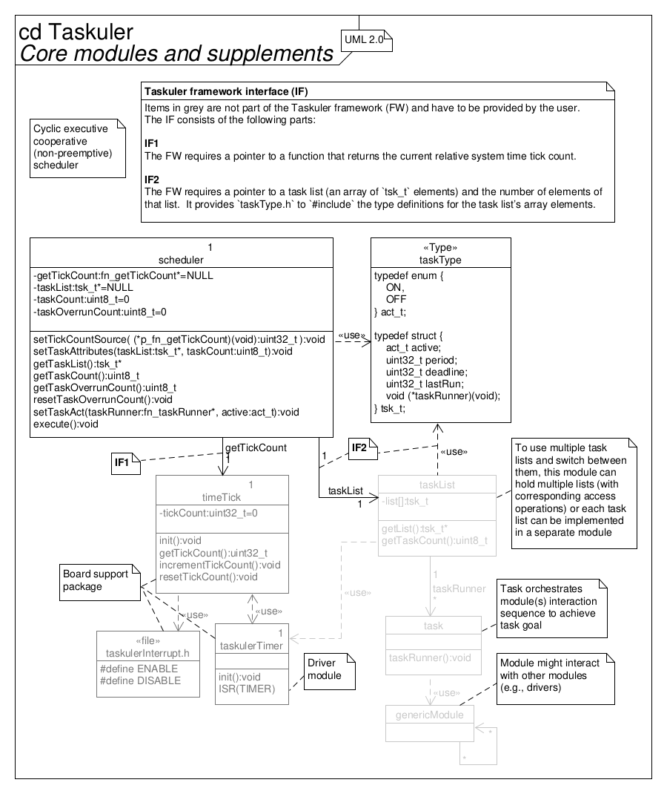
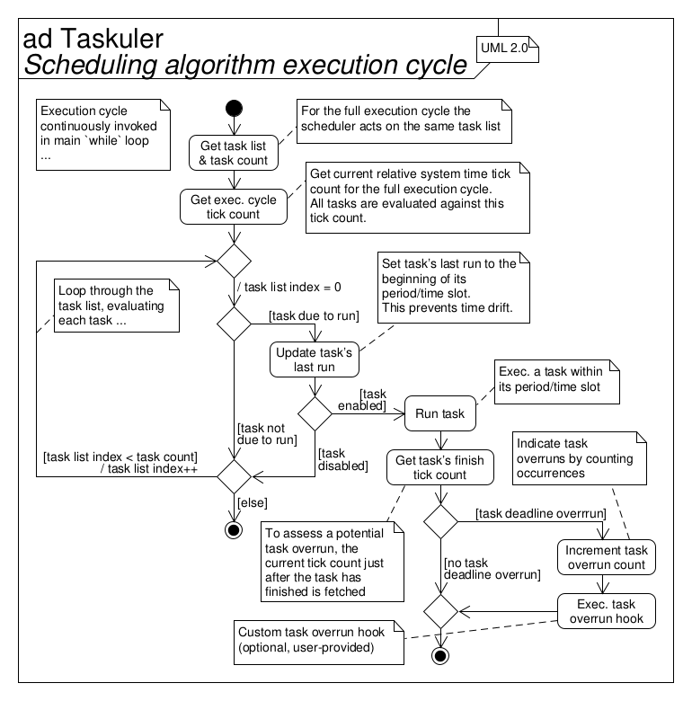
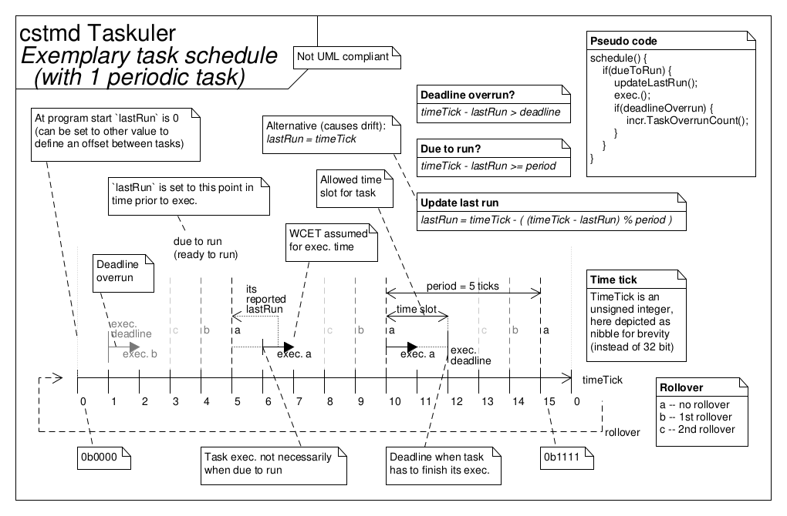
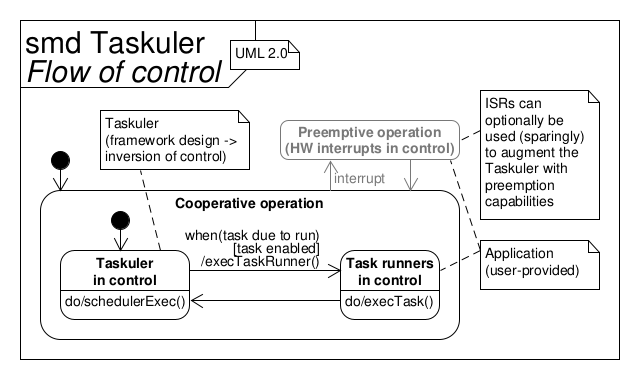
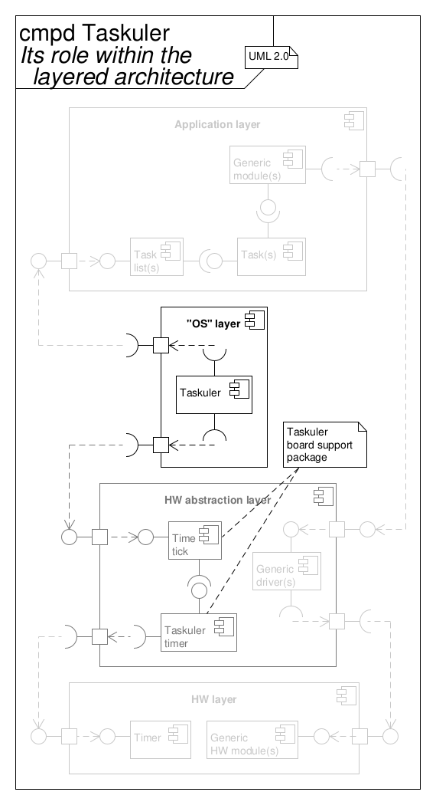
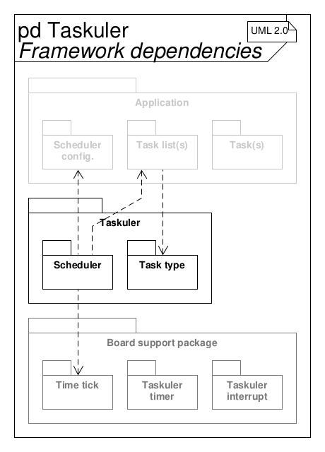

<!--
Keywords:
cooperative, cyclic-executive, embedded, embedded-systems, framework,
microkernel, nested-critical-regions, nested-critical-sections, non-preemptive,
real-time, scheduler, timers
-->

# Taskuler - Framework sencillo de planificación de tareas "bare-metal"

Este framework emplea un sencillo y diminuto

*ejecutivo cíclico, planificador cooperativo y no preventivo*

para gestionar la ejecución de tareas.

## Especificación de requisitos

A continuación se enumeran sucintamente los requisitos, restricciones, características y objetivos.

* Planificación cíclica, cooperativa (no preventiva/ejecución hasta finalizar), monotónica (prioridades fijas) de múltiples tareas en sistemas embebidos para aplicaciones de tiempo real
* La preemoción puede lograrse a través de interrupciones de hardware
* Proporciona una funcionalidad opcional (módulo separado) para manejar secciones críticas anidadas
* La temporización de las tareas (vía listas de tareas) se predefine en tiempo de compilación
* Cambio entre múltiples listas de tareas en tiempo de ejecución
* Las tareas dentro de una lista de tareas pueden habilitarse y deshabilitarse individualmente en tiempo de ejecución
* Se pueden crear temporizadores con tareas de disparo único (one-shot), cuya marca de tiempo de la última ejecución se actualiza al habilitarlas (iniciarlas)
* Cada tarea puede programarse individualmente mediante su periodo y su desplazamiento (offset) respecto a otras tareas
* Detección/indicación de exceso de tiempo (overrun) del plazo de la tarea con un (único) contador
* Acción de recuperación opcional ante el exceso de tiempo del plazo mediante un hook personalizado
* El plazo (deadline) de cada tarea puede definirse individualmente en tiempo de compilación
* Las tareas deshabilitadas no se ejecutan, pero su indicación de última ejecución se sigue actualizando para mantener la programabilidad
* Para eliminar el desplazamiento (drift) en la invocación de tareas a lo largo del tiempo, las tareas actualizan su última ejecución a la hora de invocación "ideal" (es decir, el comienzo de su periodo/ranura temporal)
* Si una tarea, por cualquier motivo, no se ejecuta dentro de su periodo, se ejecutará "normalmente" dentro de su siguiente periodo (sin impacto en el cronograma de otras tareas)
* Funciona perfectamente en el desbordamiento (rollover) de su fuente de tick de tiempo del sistema relativo con el tipo de entero sin signo al que esté conectado

<!-- Separator -->

* Diseño del framework
* Despliegue en sistemas embebidos
* Implementación de código en el lenguaje de programación C ("C99", ISO/IEC 9899:1999)
* Interfaces con el software de aplicación a través de listas de tareas y con el hardware de la MCU (para el tick de tiempo relativo del sistema) a través de un puntero a función; ambos proporcionados por el usuario

<!-- Separator -->

* Enfoque de "Diseño por Contrato" mediante aserciones "dinámicas" (`assert(...)`)
* Bajo impacto en los presupuestos técnicos
    * Baja utilización de CPU
    * Huella de memoria pequeña en ROM (texto, datos) y RAM (datos, heap, stack)
    * Funciona (también) bien en MCUs "pequeñas" (ej. AVR ATmega328P/Arduino Uno)
* Modelo de calidad
    * "Sencillo" (baja complejidad de la arquitectura de software y diseño detallado, solo características esenciales)
    * Modular
    * Reutilizable
    * Portable
    * Pruebas unitarias con cobertura del 100 % (LOC ejecutadas, ramas tomadas, funciones llamadas)
    * Métricas de calidad definidas (ver tabla inferior)
    * Cumplimiento de MISRA-C:2012
    * Análisis estático de código superado
    * Sin asignación dinámica de memoria (vía `malloc()` o similar)
    * SCM vía Git con [Semantic Versioning](https://semver.org)
* Bien documentado (desde los requisitos pasando por la arquitectura hasta el diseño detallado), utilizando Doxygen, Markdown, diagramas personalizados, UML
* Trazabilidad desde la especificación de requisitos hasta la implementación por transitividad

Métricas de calidad:

| Métrica                                       | Objetivo |
| -------------------------------------------- | -------- |
| Núm. de parámetros/argumentos (por func.)      | \<= 6    |
| Núm. de instrucciones (por func.)              | \<= 60   |
| Núm. de estructuras de control anidadas (por func.) | \<= 5    |
| Número de complejidad ciclomática (por func.) | \<= 10   |
| Tasa de comentarios (por archivo)             | \>= 20 % |
| Cobertura de pruebas unitarias (decisión)       | = 100 %  |

## Uso de temporizadores

Los temporizadores se pueden crear utilizando una tarea de disparo único (one-shot) que se desactiva al final de su ejecución.
Su periodo define entonces la temporización del temporizador.
Al habilitar dicha tarea (es decir, iniciar el temporizador), se debe actualizar su marca de tiempo de la última ejecución.

## Arquitectura

## Estándar de codificación

### Directrices aplicables

Este proyecto pretende adherirse a las siguientes directrices (con excepciones):

* The Power of Ten - Rules for Developing Safety Critical Code (NASA/JPL; G. J. Holzmann)
* MISRA C:2012 - Guidelines for the use of the C language in critical systems

Si es necesario, se permiten desviaciones de las directrices, pero deben estar justificadas y documentadas mediante comentarios en línea.

### Otras convenciones de estilo

Además, el estilo está definido solo a grandes rasgos:

El código nuevo añadido debe utilizar el mismo estilo (es decir, "verse similar") que la base de código ya existente.

Algunas observaciones sobre los puntos no obvios de esta convención de estilo:

* Los archivos se dividen en una sección de "atributos" y una de "operaciones" (al igual que las clases en un diagrama de clases UML)
* Los `#include` se colocan en los archivos de implementación (`*.c`) del módulo, excepto cuando incluyan archivos de cabecera externos al proyecto (ej. libc) o si un módulo ya utiliza otra API interna del proyecto en su propia API (en ambos casos excepcionales, esos `#include` se colocan en el archivo de cabecera del módulo)
* Las instrucciones múltiples (que terminan en `;`) dentro de una macro se encierran en un bucle `do {...} while (false)`
* El límite para los saltos de línea es de 80 caracteres (se aceptan ligeros excesos si aumentan la legibilidad y se usan con moderación)
* Se inserta un espacio en blanco después de las palabras clave de la estructura de flujo de control (ej. `if/for/while/switch/return (...)`)
* Comentarios
    * ... pueden colocarse encima de una o varias líneas (bloque de código), dirigiéndose a todas las líneas siguientes hasta la próxima línea vacía o nivel de indentación menor
    * ... pueden colocarse al final de una línea, dirigiéndose solo a dicha línea
    * ... pueden colocarse debajo de una línea larga con un nivel de indentación adicional para referirse a esa línea larga en un bloque de código donde un comentario no cabe al final de la línea
* Los corchetes/palabras clave de cierre de estructuras de control que estén lejos se comentan para indicar a qué pertenecen (ej. `#endif /* MODULENAME_H */`)
* Las funciones/macros/variables ("globales") de la API, etc., llevan como prefijo el nombre (abreviado) de su módulo + `_`;
  si se pretende que el proyecto se incluya en otro proyecto (ej. el proyecto es una biblioteca o framework), el prefijo comienza también con hasta 3 caracteres que abrevian el nombre del proyecto
* Las variables privadas de ámbito de archivo (`static`) llevan el prefijo `pv_`
* Los punteros llevan el prefijo `p_`
* Los tipos llevan el sufijo `_t`
* En código orientado a objetos, el argumento de puntero a un objeto de una función de clase se denomina `me`

## Flujo de trabajo

Este proyecto utiliza un flujo de trabajo de Git basado en ramas temáticas (topic branches).
Las únicas ramas permanentes son "develop" (estado de desarrollo; inestable) y "master" (estado de lanzamiento; estable).
Los nuevos esfuerzos de desarrollo se realizan en ramas temáticas separadas, que luego se fusionan en develop una vez que están listas.
Para los lanzamientos, la rama "develop" se fusiona entonces en "master".
Se prefieren las fusiones de avance rápido (fast-forward), si es posible.
