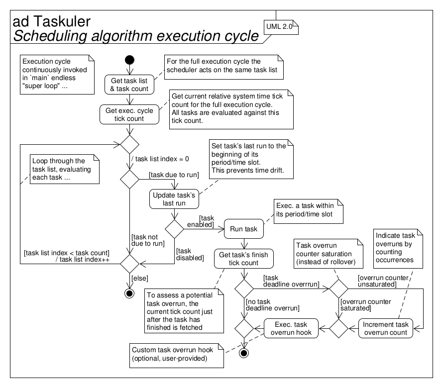
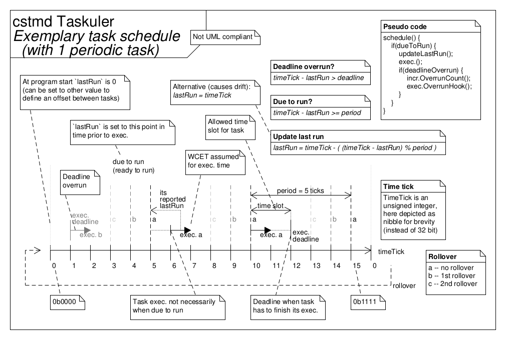

# Taskuler - Simple "bare-metal" task scheduling framework

This framework employs a simple and tiny

*cyclic executive, non-preemtive, cooperative scheduler*

to manage task execution.

## Requirements specification

The following loosely lists requirements, constraints, features and goals.

* Cyclic executive, cooperative (non-preemptive/run-to-completion), monotonic
  (fixed priorities) scheduling of multiple tasks in embedded systems for
  real-time applications
* Preemption can be achieved through hardware interrupts
* Provides an optional facility (separate module) to handle nested critical
  sections
* Timing of tasks (via task lists) is predefined at compile time
* Switch between multiple task lists at run time
* Tasks within a task list can individually be enabled and disabled at run time
* Timers can be created with one-shot tasks whos time stamp of last task run is
  updated when enbling (starting) them
* Each task can individually be scheduled by its period and its offset to other
  tasks
* Task deadline overrun detection/indication with (single) counter
* Deadline of each task can individually be defined at compile time
* Disabled tasks are not run but their last run indication is still updated to
  maintain schedulability
* To eliminate drift in task invocation over time, tasks update their last run
  to the "ideal" invocation time (that is, the beginning of their period/time
  slot)
* If a task--for whatever reason--is not executed within its period, it will
  run "normally" within its next period (without impact on the schedule of
  other tasks)
* Works flawlessly on rollover of its relative system time tick source with
  type `unsigned integer` that it is connected to

<!-- Separator -->

* Framework design
* Deployment in embedded systems
* Code implementation in the C programming language ("C99", ISO/IEC 9899:1999)
* Interfaces with the application software through task lists and with the MCU
  hardware (for the relative system time tick) through a pointer to
  function--both user-provided

<!-- Separator -->

* Low impact on technical budgets
    * Low CPU utilization
    * Small memory footprint in ROM (text, data) and RAM (data, heap, stack)
    * Runs (also) well on "small" MCUs (e.g., AVR ATmega328P/Arduino Uno)
* Quality model
    * "Simple" (low complexity of software architecture and detailed design,
      essential features only)
    * Modular
    * Re-usable
    * Portable
    * No unused ("dead") code: optional functionality in seperate translation
      units (so it can be excluded by the linker) or conditionally included via
      preprocessor defines
    * Unit tested with 100 % coverage (LOC executed, branches taken, functions
      called)
    * Defined quality metrics (see table below)
    * MISRA-C:2012 compliant
    * Static code analysis pass
    * No dynamic memory allocation (via `malloc()` or similar)
    * SCM via Git with semantic versioning
* Well documented (from requirements over architecture to detailed design),
  using Doxygen, Markdown, custom diagrams, UML
* Traceability from requirements specification to implementation by
  transitivity

Quality metrics:

| Metric                                       | Target   |
| -------------------------------------------- | -------- |
| No. of parameters/arguments (per func.)      | \<= 6    |
| No. of instructions (per func.)              | \<= 100  |
| No. of nested control structures (per func.) | \<= 5    |
| Cyclomatic complexity number (per func.)     | \<= 10   |
| Comment rate (per file)                      | \>= 20 % |
| Unit test (decision) coverage                | = 100 %  |

## Using timers

Timers can be created by using a one-shot task that deactives itself at the end
of its execution).
Its period then defines the timer’s timing.
When enabling such a task (i.e., starting the timer), its time stamp of last
task run must be updated.

## Architecture

