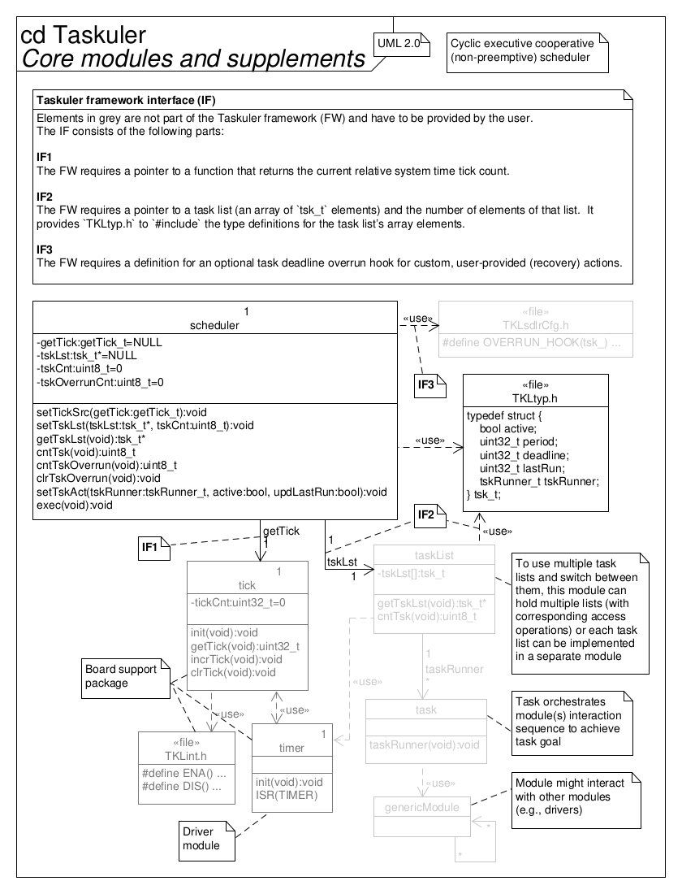

<!--
Keywords:
cooperative, cyclic-executive, embedded, embedded-systems, framework,
microkernel, nested-critical-regions, nested-critical-sections, non-preemptive,
real-time, scheduler, timers
-->

# Taskuler - Simple "bare-metal" task scheduling framework

This framework employs a simple and tiny

*cyclic executive, non-preemtive, cooperative scheduler*

to manage task execution.

## Requirements specification

The following loosely lists requirements, constraints, features and goals.

* Cyclic executive, cooperative (non-preemptive/run-to-completion), monotonic
  (fixed priorities) scheduling of multiple tasks in embedded systems for
  real-time applications
* Preemption can be achieved through hardware interrupts
* Provides an optional facility (separate module) to handle nested critical
  sections
* Timing of tasks (via task lists) is predefined at compile time
* Switch between multiple task lists at run time
* Tasks within a task list can individually be enabled and disabled at run time
* Timers can be created with one-shot tasks whos time stamp of last task run is
  updated when enbling (starting) them
* Each task can individually be scheduled by its period and its offset to other
  tasks
* Task deadline overrun detection/indication with (single) counter
* Optional task deadline overrun (recovery) action with custom hook
* Deadline of each task can individually be defined at compile time
* Disabled tasks are not run but their last run indication is still updated to
  maintain schedulability
* To eliminate drift in task invocation over time, tasks update their last run
  to the "ideal" invocation time (that is, the beginning of their period/time
  slot)
* If a task--for whatever reason--is not executed within its period, it will
  run "normally" within its next period (without impact on the schedule of
  other tasks)
* Works flawlessly on rollover of its relative system time tick source with
  unsigned integer type that it is connected to

<!-- Separator -->

* Framework design
* Deployment in embedded systems
* Code implementation in the C programming language ("C99", ISO/IEC 9899:1999)
* Interfaces with the application software through task lists and with the MCU
  hardware (for the relative system time tick) through a pointer to
  function--both user-provided

<!-- Separator -->

* "Design by Contract" approach via "dynamic" assertions (`assert(...)`)
* Low impact on technical budgets
    * Low CPU utilization
    * Small memory footprint in ROM (text, data) and RAM (data, heap, stack)
    * Runs (also) well on "small" MCUs (e.g., AVR ATmega328P/Arduino Uno)
* Quality model
    * "Simple" (low complexity of software architecture and detailed design,
      essential features only)
    * Modular
    * Re-usable
    * Portable
    * Unit tested with 100 % coverage (LOC executed, branches taken, functions
      called)
    * Defined quality metrics (see table below)
    * MISRA-C:2012 compliant
    * Static code analysis pass
    * No dynamic memory allocation (via `malloc()` or similar)
    * SCM via Git with [Semantic Versioning](https://semver.org)
* Well documented (from requirements over architecture to detailed design),
  using Doxygen, Markdown, custom diagrams, UML
* Traceability from requirements specification to implementation by
  transitivity

Quality metrics:

| Metric                                       | Target   |
| -------------------------------------------- | -------- |
| No. of parameters/arguments (per func.)      | \<= 6    |
| No. of instructions (per func.)              | \<= 60   |
| No. of nested control structures (per func.) | \<= 5    |
| Cyclomatic complexity number (per func.)     | \<= 10   |
| Comment rate (per file)                      | \>= 20 % |
| Unit test (decision) coverage                | = 100 %  |

## Using timers

Timers can be created by using a one-shot task that deactives itself at the end
of its execution.
Its period then defines the timer’s timing.
When enabling such a task (i.e., starting the timer), its time stamp of last
task run must be updated.

## Architecture

## Coding standard

### Applicable guidelines

This project aims to adhere to the following guidelines (with exceptions):

* The Power of Ten - Rules for Developing Safety Critical Code (NASA/JPL; G. J.
  Holzmann)
* MISRA C:2012 - Guidelines for the use of the C language in critical systems

If necessary, deviations from the guidelines are allowed but must be justified
and documented by means of inline comments.

### Further style conventions

Furthermore, the style is only loosely defined:

New added code should use the same style (i.e. "look similar") as the already
existing code base.

Some remarks on the non-obvious points of this style convention:

* Files are divided into an "attributes" and "operations" section (just like
  classes in a UML class diagram)
* `#include`s are placed in a module’s implementation (`*.c`) file(s), except
  when they include header files external to the project (e.g. libc) or if a
  module already uses another project-internal API in its own API (in both
  exceptional cases those `#include`s are then placed in the module’s header
  file)
* Multiple instructions (ending with `;`) within a macro are enclosed in a
  `do {...} while (false)` loop
* The limit for line breaks is 80 characters (slight overshoots are acceptable
  if it increases readability and if used sparingly)
* Whitespace is inserted after control flow structure keywords (e.g.
  `if/for/while/switch/return (...)`)
* Comments
    * ... can be placed above one or multiple line(s) (code block), addressing
      all following line(s) until the next empty line or lesser indentation
      level
    * ... can be placed at the end of a line, addressing this line only
    * ... can be placed below a long line with one additional indentation level
      to address this one long line in a code block where a comment does not
      fit at the end of the line
* Far away closing brackets/keywords of control structures are commented to
  indicate to what they belong (e.g. `#endif /* MODULENAME_H */`)
* API functions/macros/variables ("globals") etc. are prefixed with their
  module’s (abbreviated) name + `_`;  
  if the project is intended to be included in another project (e.g. the
  project is a library or framework), the prefix also starts with up to 3
  characters that abbreviate the project name
* Private, file-scope (`static`) variables are prefixed with `pv_`
* Pointers are prefixed with `p_`
* Types are suffixed with `_t`
* In object-oriented code, the pointer argument to an object of a class’
  function is named `me`

## Workflow

This project uses a simple topic branch Git workflow.
The only permanently existing branches are "develop" (development status;
unstable) and "master" (release status; stable).
New development efforts are done in separate topic branches, which are then
merged into develop once ready.
For releases, the "develop" branch is then merged into "master".
Fast-forward merges are preferred, if possible.
