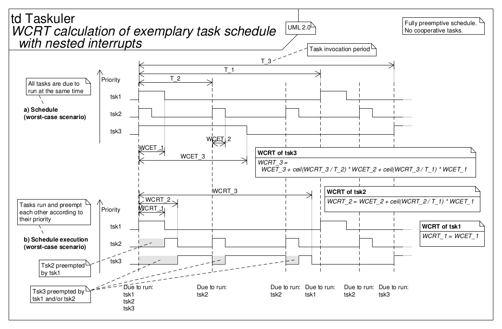

# CPU utilization and schedulability

The key points of the schedulability analysis are the computation of the CPU
utilization (load) and the assessment of the schedulability via deadline
overrun detection, which are explained here.
Preemption, that is preemptive tasks, are typically implemented using the MCU’s
nested (prioritized) interrupts.

## Model assumptions of the schedulability analysis algorithm

The deadline-monotonic scheduling (DMS) scheme is employed, so the typical
definitions for this scheduling scheme apply, with the exception that only a
few tasks are preemptive:

* All tasks have deadlines less than or equal to their periods,
* all tasks do not block each other’s execution (e.g., by accessing mutually
  exclusive shared resources),
* static priorities are assigned according to the deadline-monotonic
  conventions (tasks with shorter periods/deadlines are given higher
  priorities),
* context switch times and other thread operations introduce no overhead and so
  have no impact on the model,
* all tasks have zero invocation jitter (the time from the task arriving to it
  becoming ready to execute).

The task set consists of preemptive and cooperative tasks.
Therefore, task preemption is excluded from the above model.
That is, the task with the highest static priority that is due to run may not
immediately preempt all other tasks.

The upper bounds (e.g., least upper bound, hyperbolic bound) assessments on CPU
utilization typically used with rate-monotonic scheduling (RMS) do not apply to
the DMS (of a preemptive and cooperative task set mix), as it is used with the
Taskuler.
While for RMS, these upper bounds provide sufficient conditions, they do not
provide sufficient nor necessary conditions for DMS (of a preemptive and
cooperative task set mix).
They provide no information about the schedulability or the boundaries of the
system.
Therefore, upper bounds assessments on CPU utilization are not further
discussed.

## The algorithm

The goal of the schedulability analysis is to assess whether a given task set
(tasks within a task list) can be scheduled, i.e., whether its schedulability
is feasable.

For that, the two main objectives are:

* Objective 1 - Assert that the total CPU load is below the target limit
* Objective 2 - Assert that each task’s WCRT is less than or equal to its
  deadline

### Inputs

To reach the above mentioned objectives, the algorithm needs the time (in
seconds) equal to one (relative system) time tick and the timing table with the
following information for each task:

* Task name
* schedule type (preemptive/cooperative)
* Frequency
* Deadline
* WCET

Sporadic tasks must be converted to periodic tasks, assuming the worst-case
inter-arrival time as their periods.

### Preprocessing

The timing table must be sorted according to the deadline-monotonic
conventions, i.e., tasks (the rows of the table) must be ordered by their
priority (tasks with shorter deadlines are given higher, ascending priorities).

The task period, needed in the following sections, is simply the reciprocal of
the frequency.

### Objective 1 - Calculate total CPU load

The CPU utilization factor per task is simply its WCET divided by its period.
The total CPU load is then the sum of all task’s CPU utilization factors.
See [1].

The total CPU load can then be compared to the total CPU load target limit.

### Objective 2 - Calculate WCRT

#### WCET

The worst-case execution time (WCET) is the assumed uninterrupted processing
time a SW unit (e.g., a task) consumes in a worst-case scenario.
The processing time is not exactly deterministic, hence it may vary with
different invocations.
From this task invocations data set, the sample with the longest processing
time is assumed to be the WCET of that task.

However, with multipe tasks scheduled, this WCET cannot be assumed to be the
worst-case time span between a task’s ideal invocation (when its ready to run)
and its completion.

#### WCRT of a purely preemptive task set scheduled by nested (prioritized) interrupts

In a preemptive scheduling scheme, a task’s invocation might be delayed or its
execution interrupted (preempted) by another task with higher priority, in
which case its WCET is stretched and becomes its worst-case response time
(WCRT)--the time span from when its due to run to its actual completion.

The figure a) below shows the schedule as it is supposed to run in that
("critical") time instance.
The figure b) below depicts how this schedule would actually be executed and
the composition of each task’s WCRT.

The equations in the above figure are recursive and must be solved iteratively
(see step 2 of the employed algorithm below).
For more detailed information, see [2] (the equation applied here is eq.
(1)).

#### WCRT of a purely cooperative task set scheduled by the cyclic executive, cooperative scheduler

With a cooperative scheduling scheme, a task cannot be preempted--it has to
yield and give back control to the scheduler voluntarily.
However, its invocation can still be delayed by either (a) higher priority
tasks that are due to run at the same time or (c) by a not yet finished, lower
priority task that was started at a previous time instance--or (b) even by a
combination of both.
Both cases of delay contribute to a task’s WCRT, prolonging its WCET.

The figure below shows such worst-case scenarios for an exemplary task set,
constituting its tasks’ WCRTs for above mentioned scenarios a) to c).

#### Combined WCRT of a preemptive and cooperative task set mix

Ultimately, the Taskuler is used to schedule most tasks cooperatively but is
augmented by (nested) interrupts for the scheduling of some high priority
tasks.
Thus, the system consists of a preemptive and cooperative task set mix and the
calculation of the resulting WCRT is a combination of the WCRT of both task
types.

The algorithm consists of Steps 1--4.3.

**Step 1**

Divide timing table in two separate tables, one with all preemptive and one
with all cooperative tasks.

**Step 2**

Calculate the WCRT for each task in the preemptive timing table as per [2],
eq. (1).
(The WCRT of the highest priority preemptive task is its WCET.)

This equation is recursive and must be solved iteratively.
The calculation is finished, once the result converged.
A WCRT calculation iteration limit must be defined after which no convergence
is assumed.

These are now the final WCRTs for each preemptive task, including interruptions
by other, higher priority preemptive tasks.

**Step 3**

Calculate the WCRT' for each task in the cooperative timing table.

Here, WCRT' denotes the resulting WCRT of a cooperative task caused by
preempting tasks, with the effect of other cooperative tasks not yet included.

This is done by appending each cooperative task separately (as the lowest
priority task) to the preemptive timing table and calculate this cooperative
task’s WCRT' as per [2], eq. (1).

Again, this equation is recursive and must be solved iteratively (see step 2).

**Step 4**

Calculate the final WCRT for each cooperative task by performing the following
steps for the WCRT' for each task in the cooperative timing table:

* Step 4.1:  Add the sum of all higher priority cooperative task’s WCRT'.

If it is not the lowest priority task:

* Step 4.2:  Find and add the one longest WCRT' out of all lower priority
  cooperative tasks.
* Step 4.3:  Substract the time of 1 time tick.

These are now the final WCRTs for each cooperative task, including
interruptions by preemptive tasks and delays by preemptive and cooperative
tasks.

Finally, both separate timing tables, the preemptive and the cooperative timing
table, can be joined again (and sorted again by deadline).

The so calculated WCRTs can then be compared to their task’s deadlines to
detect deadline overruns and assert that the schedulability is feasible.

## References

* [1] *Scheduling Algorithms for Multiprogramming in a Hard-Real-Time
  Environment* (Journal of the Association for Computing Machinery, Vol.
  20, No. 1, 1973-01-01, pp. 46--61; C. L. Liu, J. W. Layland)
* [2] *Finding Response Times in a Real-Time System* (The Computer Journal,
  Vol. 29, No. 5, 1986; M. Joseph, P. Pandya)
